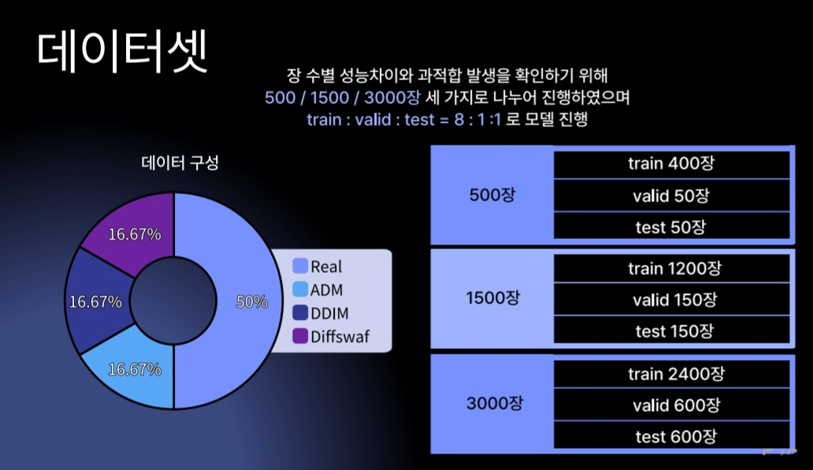
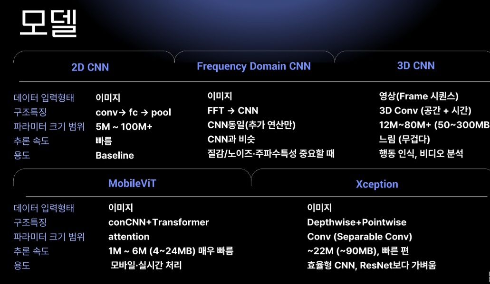
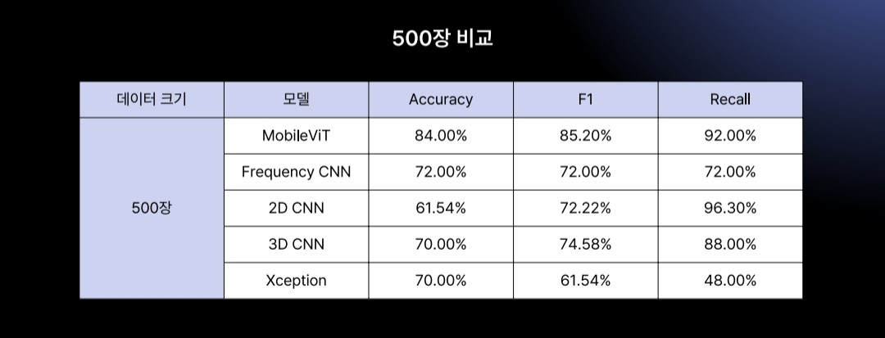
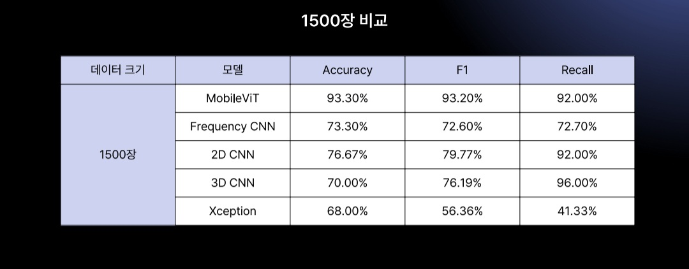
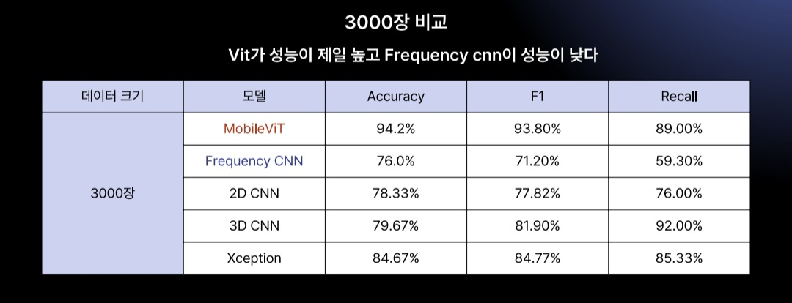
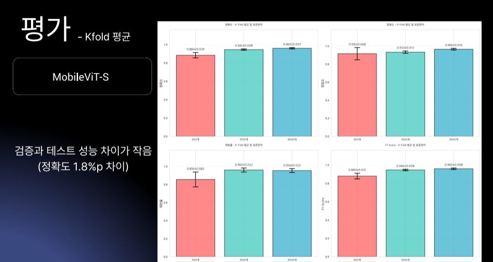
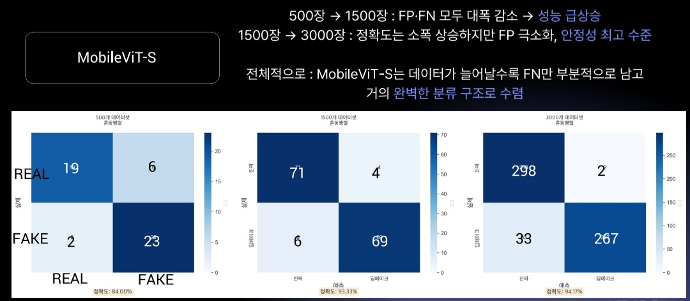

# Deepfake-Detection-MobileViT
본 프로젝트는 딥페이크 영상 및 이미지 검출을 위해 여러 모델을 비교·분석하고, 그 중 MobileViT 모델이 가진 장점과 성능을 정리한다.

최종 모델 MobileViT 

CNN + ViT 구조 결합

CNN의 국소적 패턴 학습 능력과
ViT의 전역 정보 처리 능력을 적절히 혼합

국소적 왜곡(피부 결, 경계 블렌딩 오류, 노이즈 등) → CNN

얼굴 전역 형태 불일치(조명, 비율, 텍스처 흐름, 구조적 비정상성) → ViT

규칙 기반 내장 구조

이미 “이미지는 이렇게 생겼다”라는 CNN inductive bias를 내장

적은 파라미터와 작은 모델 크기로도 높은 성능

데이터 효율성

비교적 적은 데이터에서도 뛰어난 일반화 성능

  

  

  

  

  

  

  

